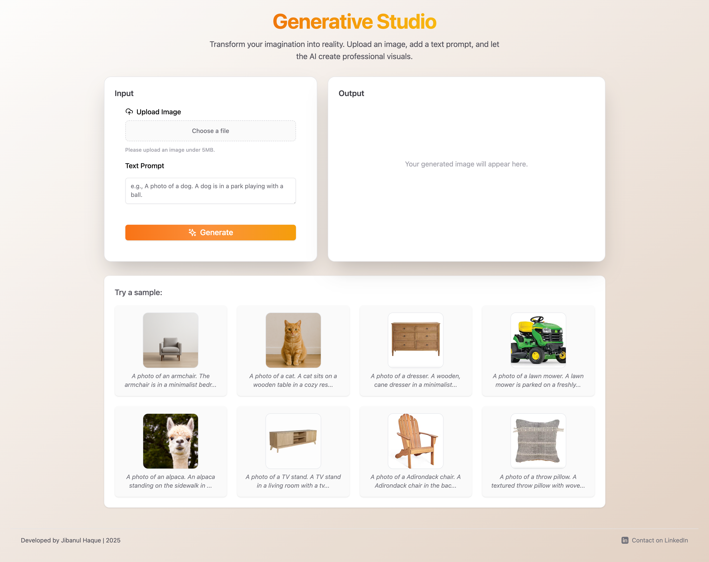

# subjectgen-flux

This is a full-stack project for generating subject-specific images using FLUX, LoRA, DINO, and an IR model. It features a FastAPI backend for model inference and image generation, along with a modern frontend built with Vite, React, and Tailwind CSS for user interaction.

## 🌐 Live Preview

**Note:** The demo is currently offline (GPU temporarily unavailable).  
You can still explore the code and run it locally.

🔗 [genstudio-ai.web.app](https://genstudio-ai.web.app/)

[](https://genstudio-ai.web.app/)


## 🎯 Goal

To explore end-to-end development for computer vision applications, including model development, backend integration, and frontend interaction.

---

## Project Structure

```
subjectgen-flux/
├── backend/
│   └── app/
│       ├── main.py
│       ├── flux_infer_combined.py
│       ├── inference_delete.py
│       ├── model_loader.py
│       ├── generated_outputs/
│       ├── generated_outputs_keep_demonstration/
│       ├── models/
│       ├── local_pipelines/
│       └── utils/
│
│   └── third_party/
│       └── IR_dependencies/
│           ├── open_clip_280/
│           └── open_clip_280_overlap/
│
├── frontend/
│   ├── public/
│   ├── src/
│   ├── index.html
│   ├── package.json
│   ├── vite.config.ts
│   └── ... (other config files)
│
└── README.md
```

---

## Backend

- **Location:** `backend/app/`
- **Framework:** FastAPI
- **Key files:**
  - `main.py`: Main FastAPI application. Handles API endpoints, CORS, static file serving, and model loading.
  - `flux_infer_combined.py`, `inference_delete.py`, `model_loader.py`: Scripts for inference and model management.
  - `generated_outputs/`: Stores generated images, served as static files.
  - `models/`: Stores the models used for inference.
  - `local_pipelines/`, `utils/`: Supporting modules and utilities.

**How it works:**
- The backend loads the models at startup and exposes endpoints for image generation and related tasks.
- Generated images are saved in `generated_outputs/` and can be accessed via static URLs.
- CORS is enabled for frontend-backend communication.

**To run the backend:**
```bash
cd backend/app
pip install -r requirements.txt
uvicorn main:app --reload
```
The API will be available at [http://localhost:8000](http://localhost:8000).

---

## Frontend

- **Location:** `frontend/`
- **Stack:** Vite, React, Tailwind CSS
- **Key files:**
  - `src/`: React source code for the UI.
  - `public/`: Static assets (images, etc.).
  - `index.html`, `package.json`, `vite.config.ts`: Project entry and configuration.

**How it works:**
- The frontend provides a user interface for uploading images, configuring generation parameters, and viewing results.
- It communicates with the backend API (by default at `http://localhost:8000`) to request image generation and fetch results.

**To run the frontend:**
```bash
cd frontend
npm install
npm run dev
```
The app will be available at [http://localhost:5173](http://localhost:5173) (default Vite port).

---

## Usage

1. **Start the backend**  
   See backend instructions above.

2. **Start the frontend**  
   See frontend instructions above.

3. **Open your browser**  
   Go to [http://localhost:5173](http://localhost:5173) and use the UI to interact with the backend and generate images.

---

## Notes

- **Model files:**  
  Place the required model files in `backend/app/models/`.  
  This folder should contain the following models:
  - **FLUX model weights** (FLUX.1-schnell from HuggingFace)
  - **LoRA weights** (for subject-specific fine-tuning, e.g., `lora_weights.pth`)
  - **DINO model weights** (e.g., `dino_vit.pth`)
  - **IR model weights** (e.g., `ir_model.pth`)
  - Any other model files referenced in your backend code or configuration

  Make sure the filenames and formats match what is expected in your backend scripts (`model_loader.py`, etc.).

- Generated images and demonstration outputs are stored in their respective folders in `backend/app/`.
- The frontend expects the backend to be running at `http://localhost:8000`. Update the frontend API URLs if you change the backend port or host.


---

## Reference

[https://github.com/siso-paper/SISO](https://github.com/siso-paper/SISO)
